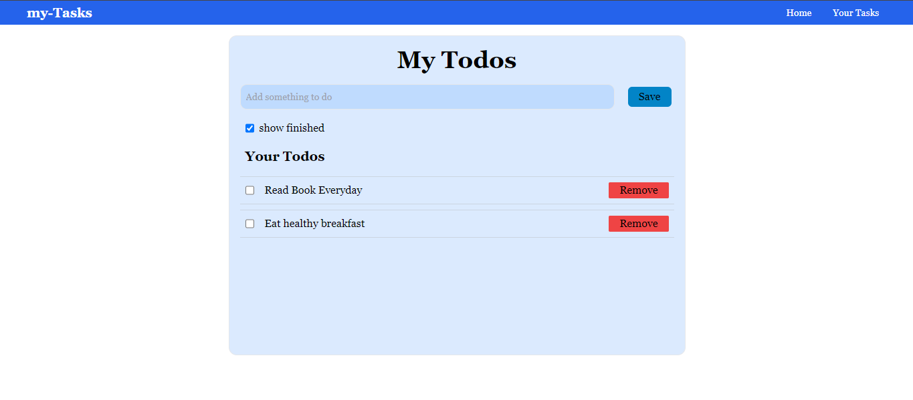

# React To-Do App

The React To-Do App is a user-friendly task management application designed to streamline your daily productivity. Built using React.js, HTML, and CSS, this app offers a clean and intuitive interface for organizing your tasks efficiently.

## Key Features

- **Task Management:** Easily add, edit, and delete tasks with simple user interactions.
- **Responsive Design:** Seamlessly adapts to various screen sizes, ensuring a consistent experience across devices.
- **Sortable Lists:** Arrange your tasks in order of priority or category for better organization.
- **Local Storage:** Your tasks are stored locally in the browser's storage, allowing you to access them even after closing the app.

## Technologies Used

- **React.js:** Front-end library for building user interfaces.
- **HTML:** Markup language for structuring web pages.
- **CSS:** Styling language for enhancing the visual presentation of the app.

## Project Preveiw

